# SyriaTel Customer Churn Prediction
### Author: Nashon Okumu

## 1. Business Understanding

### Problem Statement
    
SyriaTel is a telecommunications company that is currently facing a very high churn rate as many customers tend to discontinue and leave their services and replacing them with their competitors. The company wants to develop a customer churn prediction model that would address this issue. SyriaTel aims to gain insights on contributing factors to the high churn rate in order to reduce it, increase customer retention and maximize the company's profits.

### Objectives
To identify contributing factors of customer churn.
To develop a model to predict customers at risk of churning.
To recommend Proactive measures for customer retention.
### Metrics
A robust customer churn prediction model with high accuracy and recall of 0.80.
Key features contributing to customer churn.
Actionable insights and recommendations to SyriaTe on churn reduction and customer retention.

## 2. Data Understanding
The dataset for this project is sourced from Kaggle (https://www.kaggle.com/datasets/becksddf/churn-in-telecoms-dataset). It has been downloaded directly from Kaggle's repository of datasets. Kaggle is a well-known platform for data science competitions, providing a wide array of datasets for educational and research purposes.

This dataset appears to be a single, consolidated dataset relevant to customer churn analysis. Each feature within the dataset is crucial for understanding different aspects of customer behavior and interactions with the service provider. The relevance of this dataset lies in its comprehensive nature, covering various dimensions such as service usage, financial charges, and customer support interactions, all of which are pivotal in predicting churn.

By analyzing these features, we can build predictive models to identify customers who are likely to churn, enabling the company to take proactive measures to retain them.

#### Categorical Features:

`state`: The state where the customer resides.

`phone number`: The phone number of the customer.

`international plan`: Whether the customer has an international plan (Yes or No).

`voice mail plan`: Whether the customer has a voice mail plan (Yes or No).

#### Numeric Features:

`area code`: The area code associated with the customer's phone number.

`account length`: The number of days the customer has been an account holder.

`number vmail messages`: The number of voice mail messages received by the customer.

`total day minutes`: The total number of minutes the customer used during the day.

`total day calls`: The total number of calls made by the customer during the day.

`total day charge`: The total charges incurred by the customer for daytime usage.

`total eve minutes`: The total number of minutes the customer used during the evening.

`total eve calls`: The total number of calls made by the customer during the evening.

`total eve charge`: The total charges incurred by the customer for evening usage.

`total night minutes`: The total number of minutes the customer used during the night.

`total night calls`: The total number of calls made by the customer during the night.

`total night charge`: The total charges incurred by the customer for nighttime usage.

`total intl minutes`: The total number of international minutes used by the customer.

`total intl calls`: The total number of international calls made by the customer.

`total intl charge`: The total charges incurred by the customer for international usage.

`customer service calls`: The number of customer service calls made by the customer.

## 3. Data Preparation

## Data Cleaning
Before Proceeding to the Analysis, there is need to first handle the missing values and duplicates in order to preserve integrity of the data

### Exploratory Data Analysis (EDA)

This section explores and uncovers the patterns in the dataset, and how the variables are related.

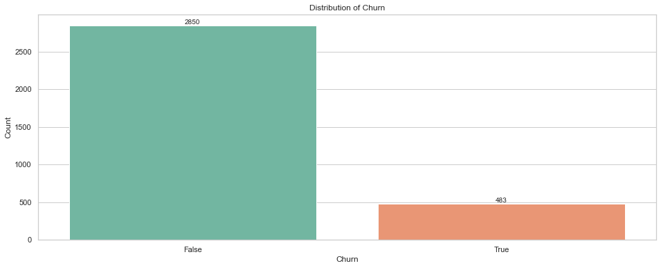

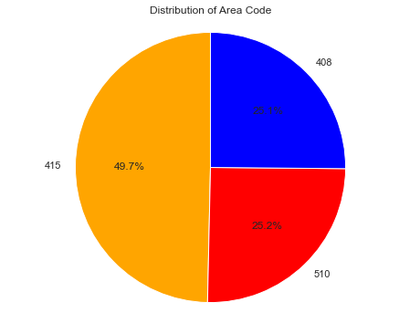

#### Distribution of Numerical Features
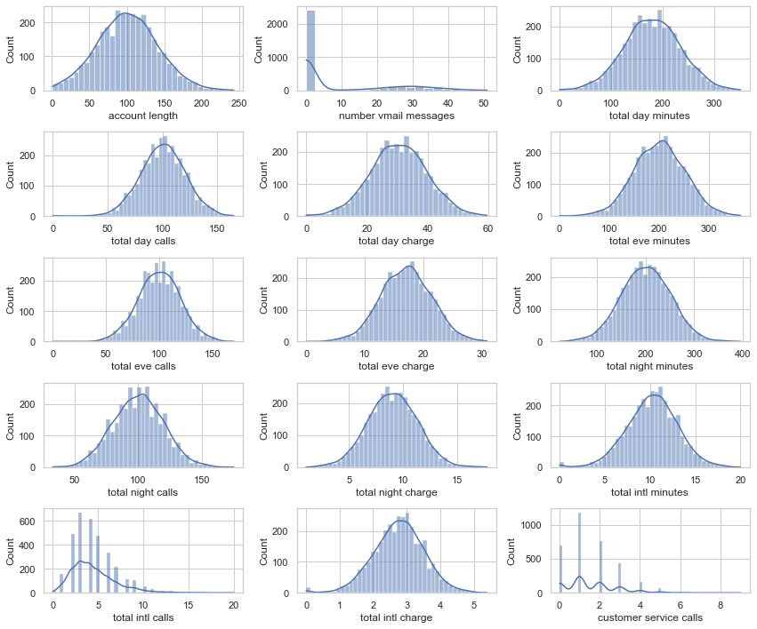

#### Distribution of Categorical Features
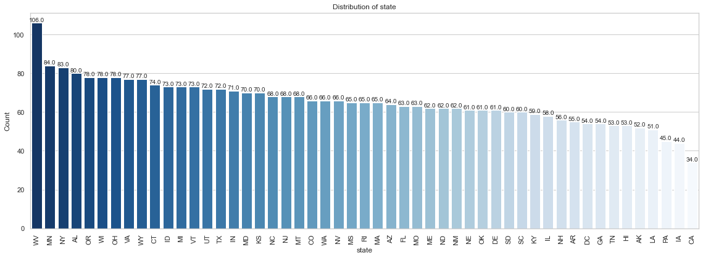

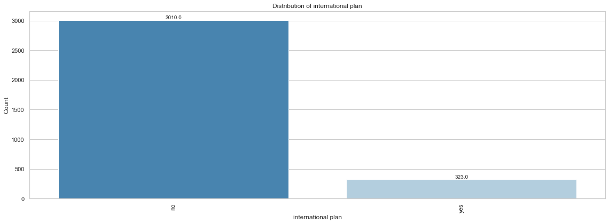

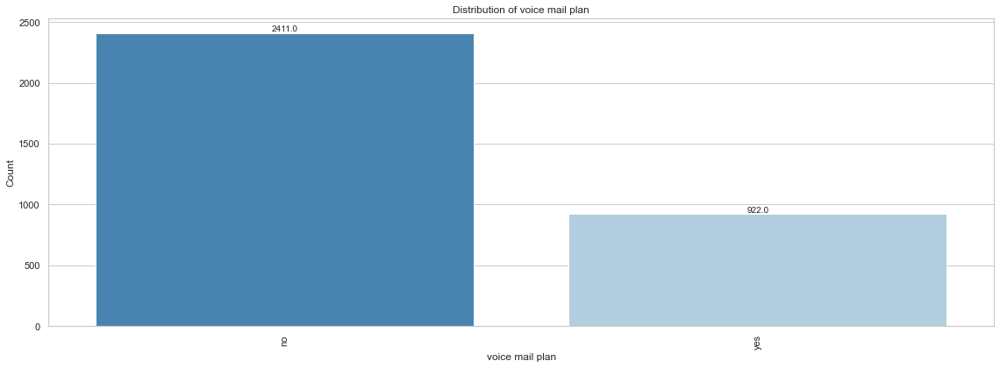

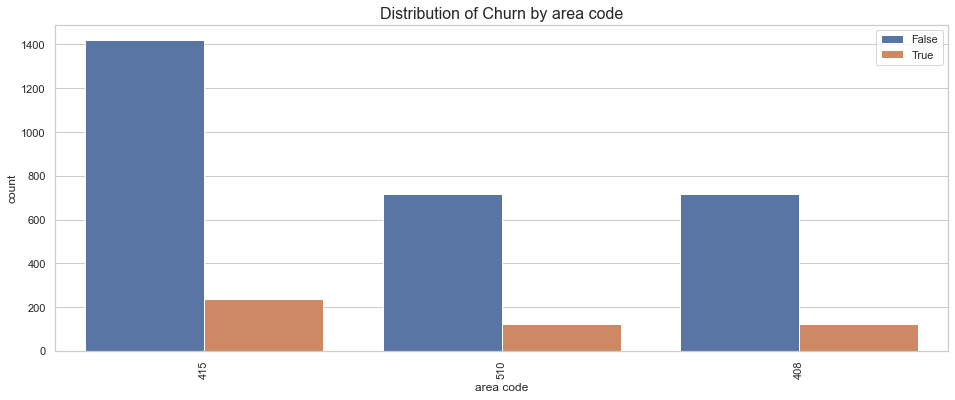

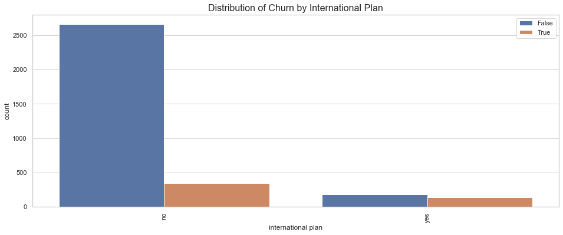

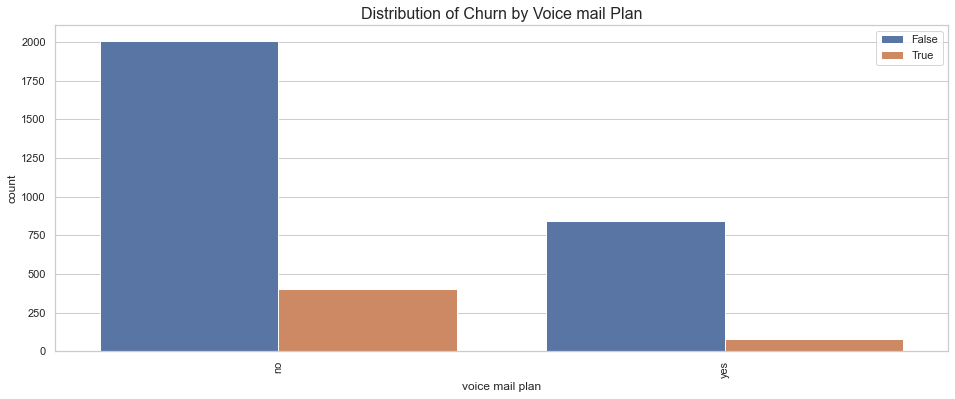

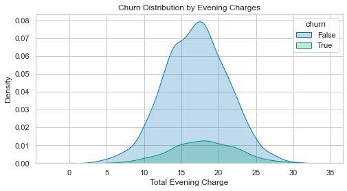

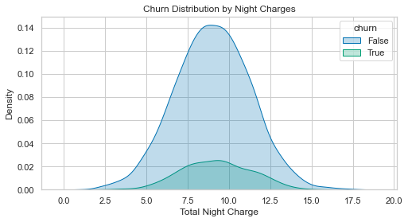

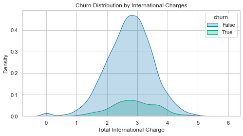

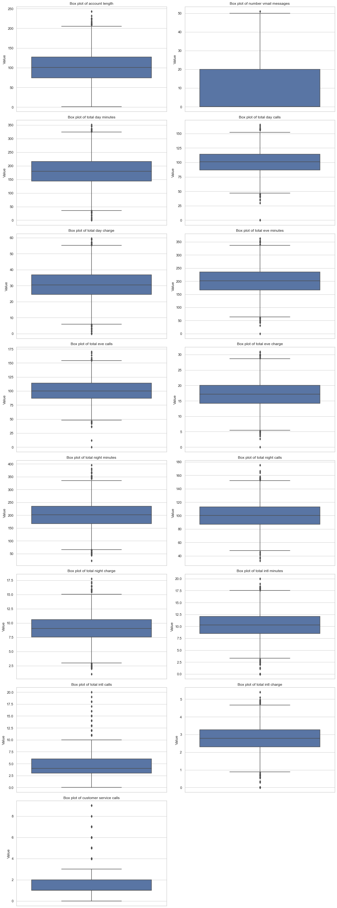

### Correlation Analysis

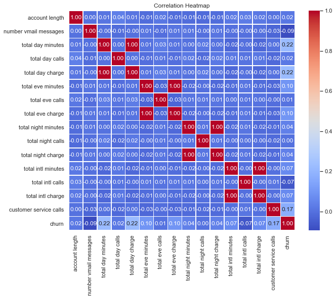

## 4. Modeling

### Logistic Regression 
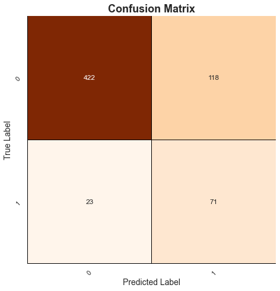

### Decision Tree

### Random Forest
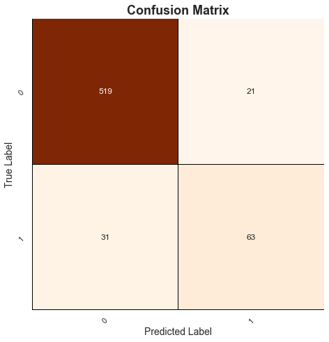

### XG Boost

## 5. Model Evaluation

### Recall Scores
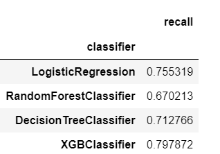

### ROC Curves

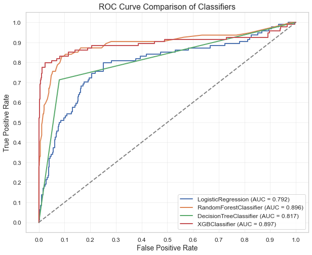

## Feature Importances

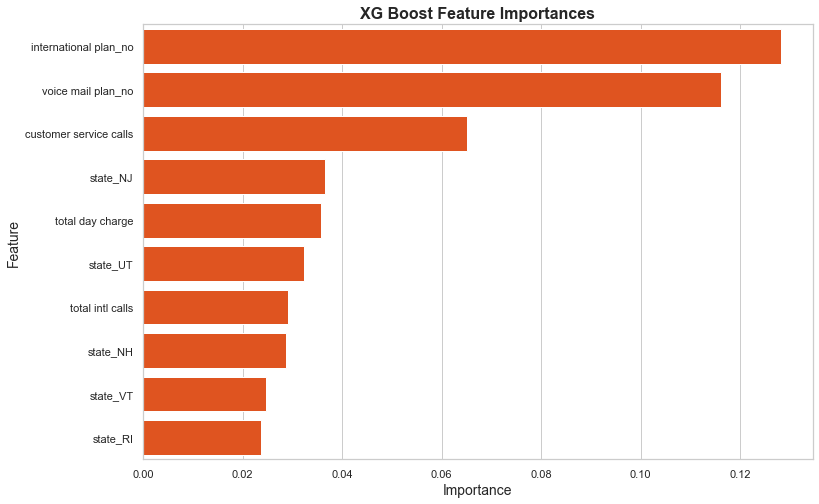

## 6. Conclusion

The XG Boost Classifier has the highest recall score of 0.8 that is 80%. It is also the best performing model according to the ROC curve. We achieve the objective as the model is able to predict customer churn at the expected recall score.